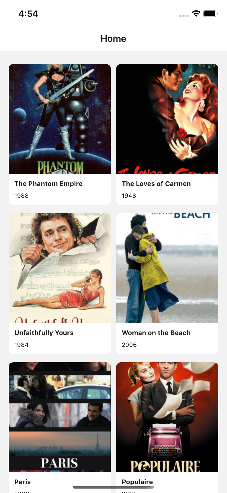
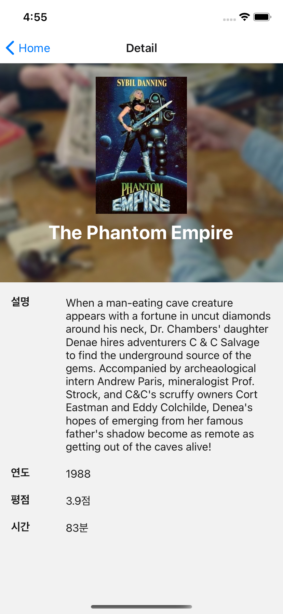

# React Native 사전과제

## 무엇을 하면 될까요?

- Movie List 화면 개발
- Movie Detail 화면 개발

## 참고사항

- Expo 방식이 아닌 순수 React Native으로 프로젝트를 구성해주세요.
- react-navigation 을 사용하여 화면 스택을 구성해주세요.

### 1. Movie List

> API_URL : https://yts.mx/api/v2/list_movies.json?page=<페이지 번호>&limit=8

- 위의 UI를 구성해주세요.
- 첨부한 API_URL 요청을 통해서 영화 리스트를 구성해주세요.
- 무한 스크롤 페이지네이션으로 구현해주세요. (`limit`는 8로 고정해주세요.)
- 한 Column 당 2개의 아이템이 표시되도록 해주세요.
- 영화 아이템에 `id` , `title`, `medium_cover_image`, `year` 데이터를 활용해주세요.
- 영화 아이템 클릭 시, id 기반 Detail 화면으로 넘어가게 해주세요.

### 2. Movie Detail

> API_URL : https://yts.mx/api/v2/movie_details.json?movie_id=<영화 ID>

- 위의 UI를 구성해주세요.
- 영화 리스트 화면에서 영화 ID 값을 받아와 해당 ID의 정보를 표시해주세요.
- 첨부한 API_URL 요청을 통해서 영화 상세 화면을 구성해주세요.
- , `title`, `background_image`, `large_cover_image`, `year`, `description_full`, `rating`, `runtime` 데이터를 활용해주세요.
- 상단에는 영화 배경 이미지, 영화 포스터 이미지, 제목을 배치해주세요
- 하단에는 영화 설명, 제작연도, 평점, 런타임 정보를 표시해주세요.

## 목표

- 기본적인 React Native Component 활용법에 대해 확인
- 비동기로 실행되는 자바스크립트에서 서버 데이터를 받아 제어할 수 있는지 확인
- 제시된 디자인을 가지고 스타일링을 할 수 있는지 확인

## 제출방법

- 서류 제출 시 작성한 자신의 github에 `fetching_react_native_이름`의 저장소를 생성하여 업로드 해주세요.
- 저장소는 반드시 Public으로 설정해주세요.

## 문의사항

- 사전과제를 진행하며 궁금한 점은 아래의 이메일을 통해 문의해주시기 바랍니다.

## 예시

- 첨부한 example.mp4 파일로 과제 예시를 확인해볼 수 있습니다.
